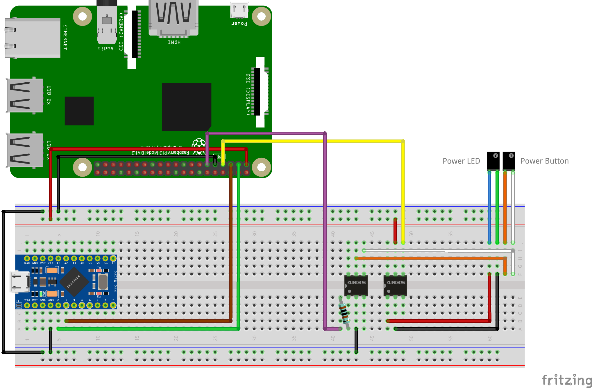

# Thinkpad BIOS password bruteforce
This project uses a raspberry pi and an ATMEGA32U4 board 
to try to unlock the supervisor of a Thinkpad P14s.

## Usage
1. Build the platformio project in the [keyboard directory](keyboard) 
and flash it to the ATMEGA32U4 board.
2. Connect the ATMEGA's USB microB port to the laptop.
3. Run the go project in [controller](controller) on the Raspberry pi, 
use the -file flag to point to your passwords file.

## Breadboard connections

## TODO
- Explain how it works
- Add video demo to the README
- Show how to solder wires to the power button PCB
- Reduce the time sleeping on the controller
